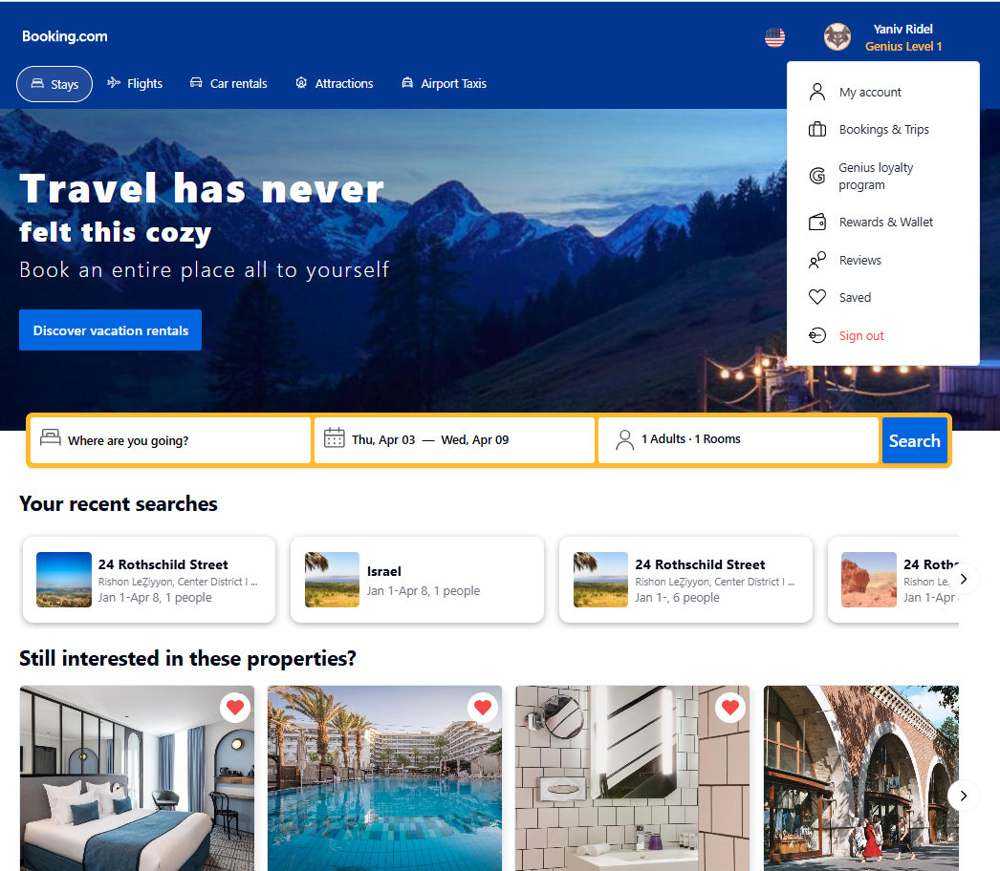
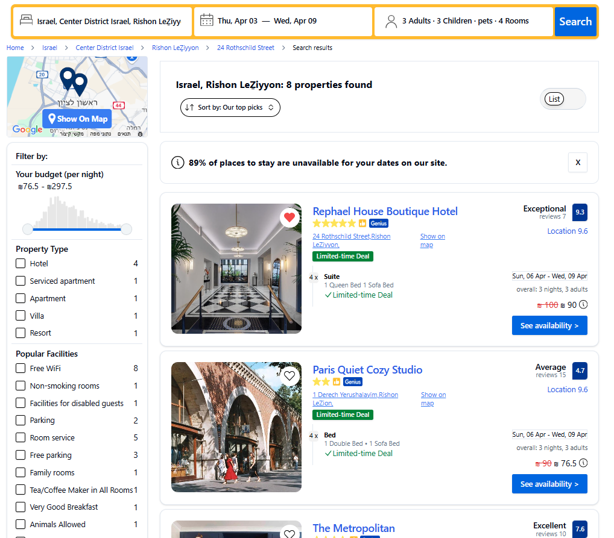
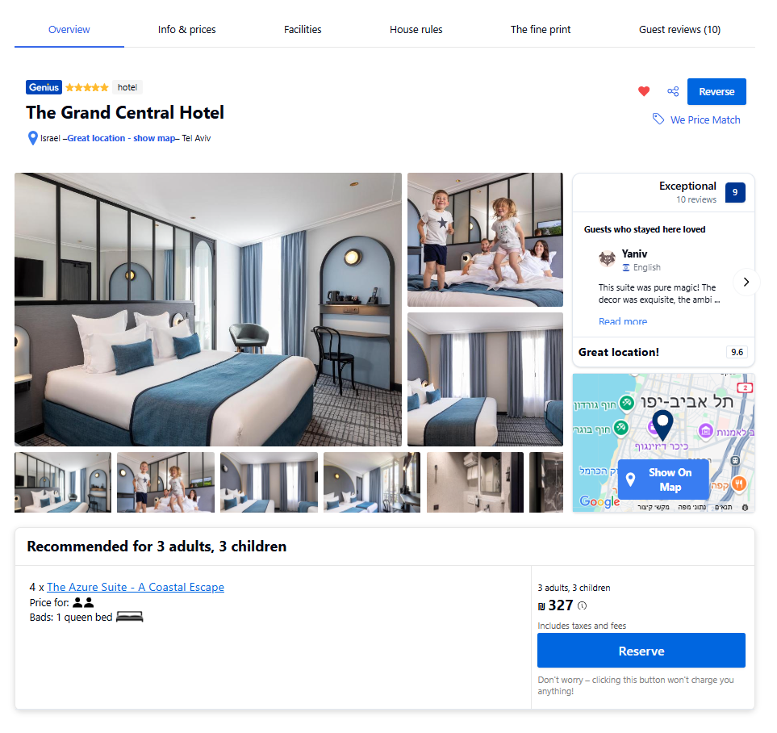
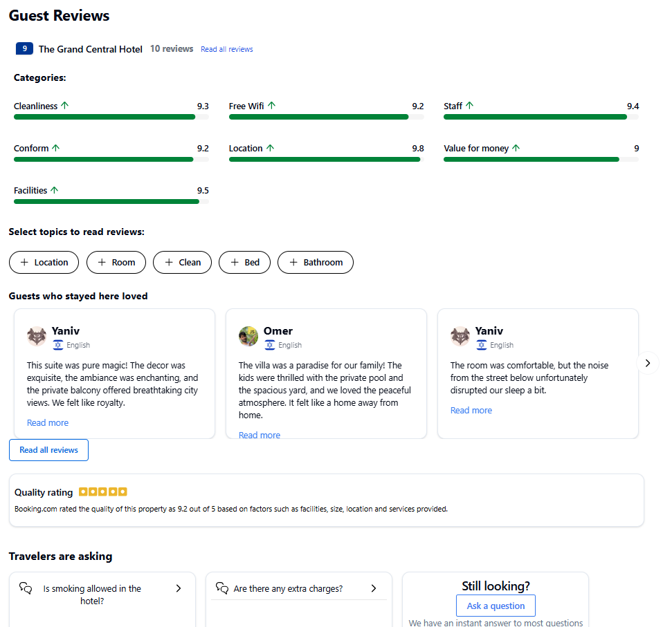
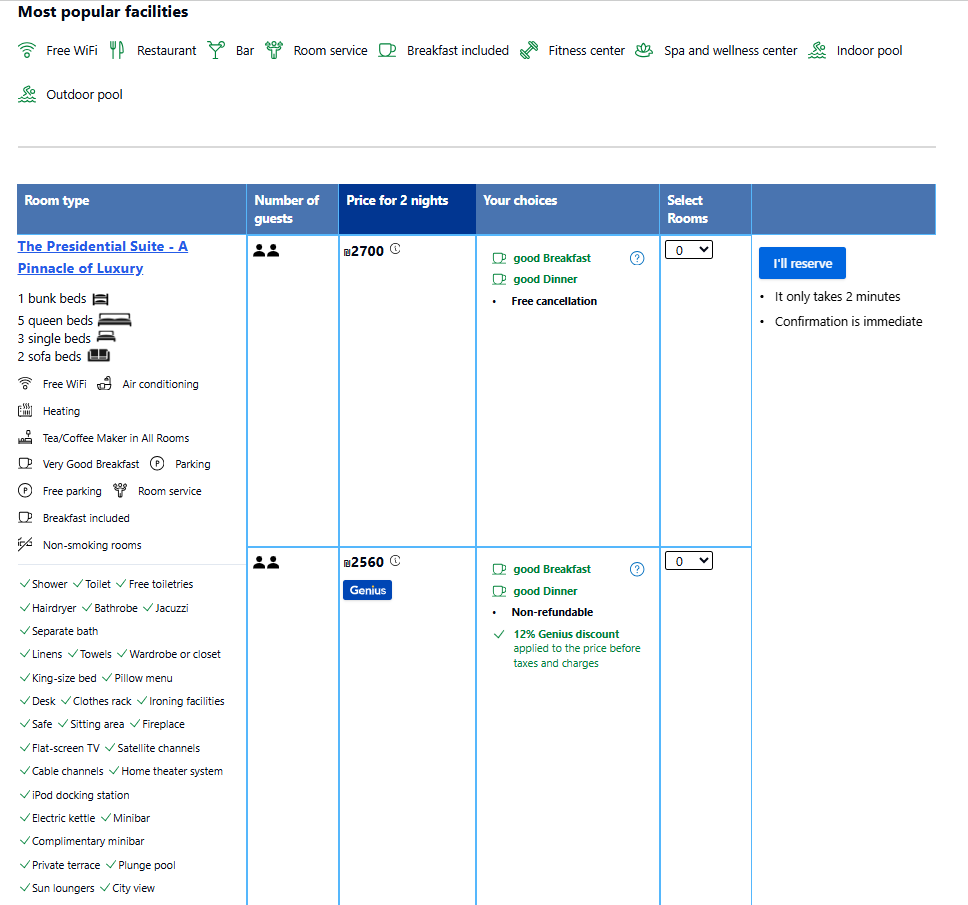
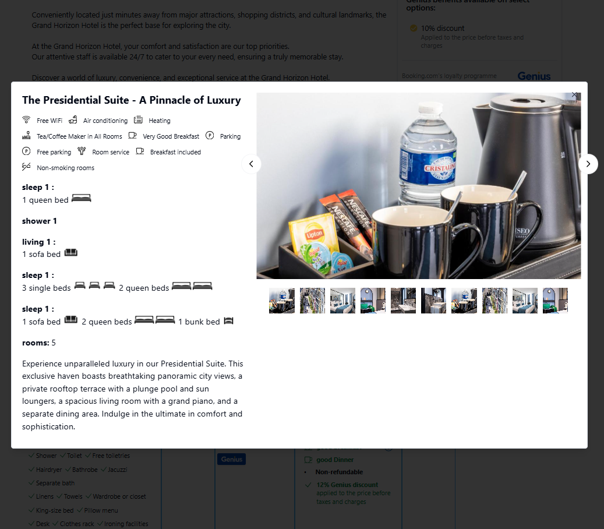
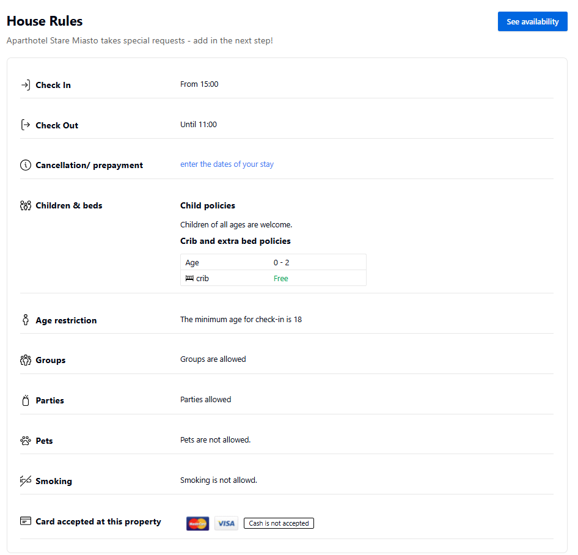
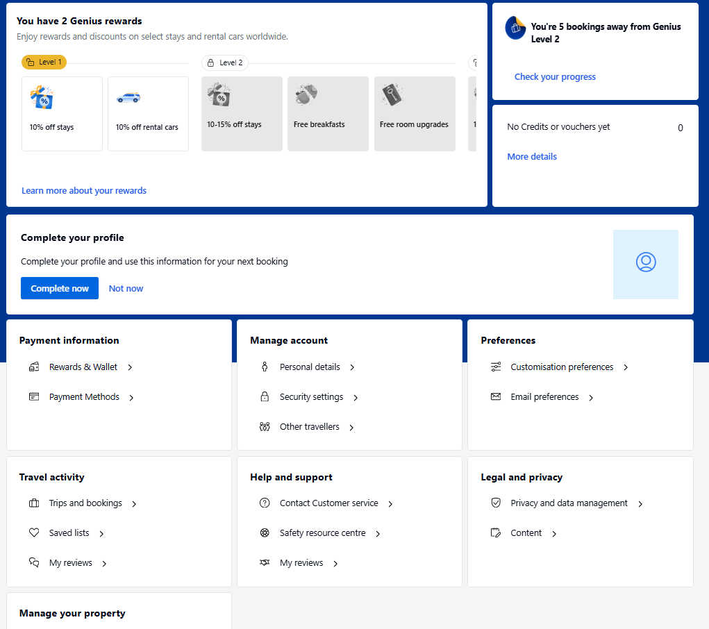
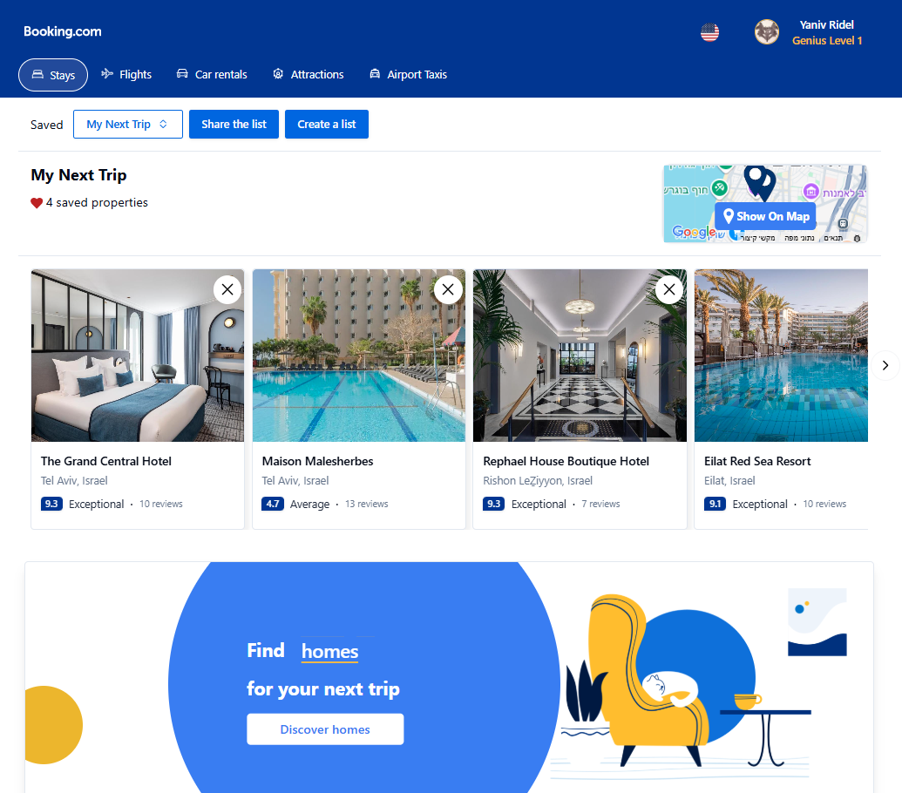

# 🚀 Booking.com Clone 🏨 – [Live Demo](https://booking-clone-client.vercel.app/)

This web application is a Booking.com Clone that allows users to search, browse, and book accommodations worldwide. The platform features user authentication, property filtering, booking management, and responsive design for seamless experience across all devices.

## Features

### 1. **User Authentication & Profiles**
   - Complete registration and login system with email verification or google auth
   - User profiles for managing personal information
   - Booking history and saved properties
   - User review and rating system

### 2. **Property Search & Filtering**
   - Advanced search with location, dates, guests, and room requirements
   - Real-time filtering by price range, star rating, property type, and amenities
   - Map-based property exploration
   - Sort by relevance, price, rating, or distance

### 3. **Property Listings**
   - Detailed property pages with photo galleries
   - Comprehensive information including amenities, policies, and availability
   - Interactive maps showing property location and nearby attractions
   - User reviews and ratings for each property

### 4. **Booking System**
   - Real-time availability checking
   - Secure booking process with multiple payment options
   - Instant confirmation emails
   - Booking modification and cancellation options

### 5. **Responsive Design**
   - Mobile-first approach ensuring functionality across all devices
   - Optimized UI/UX for smartphones, tablets, and desktops
   - Fast-loading pages with optimized assets

### 6. **Additional Features**
   - Wishlist functionality to save favorite properties
   - Price alerts and special deals notifications
   - Multi-language support

## Technologies Used

- **Frontend**: React.js, Redux, Tailwind, React Query, TypeScript
- **Backend**: Node.js, Express.js
- **Database**: MongoDB
- **Authentication**: JWT, OAuth
- **Maps Integration**: Google Maps API
- **Payment Processing**: Stripe API
- **Deployment**: Docker, Google Cloud (GCP) and Vercel

## Image Gallery

Explore the various features and UI of the Booking.com Clone through the images below:

|  |  |  |
|-----------------------------|----------------------------|------------------------------|
| Home Page - The main landing page with search functionality, featured destinations, and special offers for users to quickly find accommodations. | Search Results - Displays filtered properties based on user search criteria with sorting options, filters, and map integration. | Property Main View - Detailed property page showing high-quality images, basic information, and key features of the accommodation. |

|  |  |  |
|---------------------------------|----------------------------------|---------------------------------|
| Property Reviews - User-generated reviews and ratings section that helps potential guests make informed decisions based on previous visitors' experiences. | Property Availability - Table view showing room availability, pricing for different dates, and occupancy information. | Room Details - Specific information about each room type including amenities, size, bed options, and pricing. |

|  |  |  |
|-------------------------------------|---------------------------------|--------------------------------|
| House Rules - Important policies and regulations that guests need to know before booking, including check-in/out times and property-specific guidelines. | My Account - User profile page where guests can manage personal information, view booking history, and access account settings. | Saved Lists - Wishlist feature allowing users to save and organize favorite properties for future reference or planning. |

## Contributors

- [Yaniv Ridel](https://github.com/Yanivridel)
- [Amit Kubani](https://github.com/AgitAgit)

## Acknowledgments

- Booking.com for the inspiration
- All contributors who participated in this project
- Open source libraries and frameworks that made this project possible
